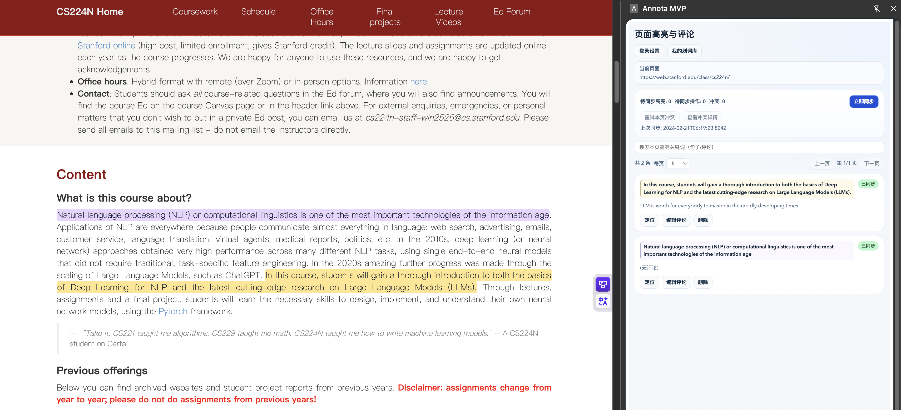
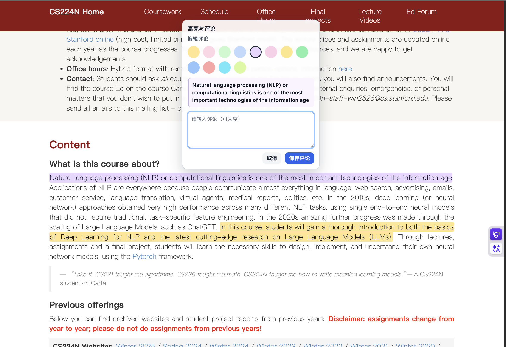
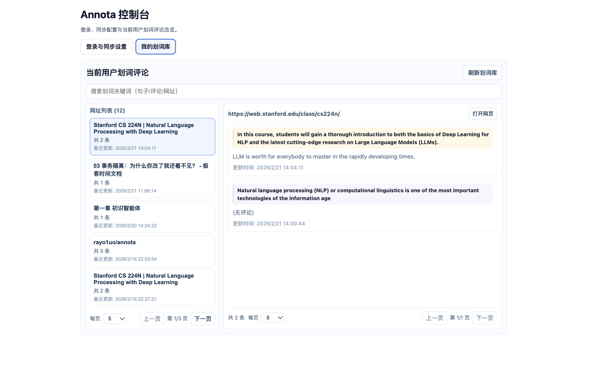
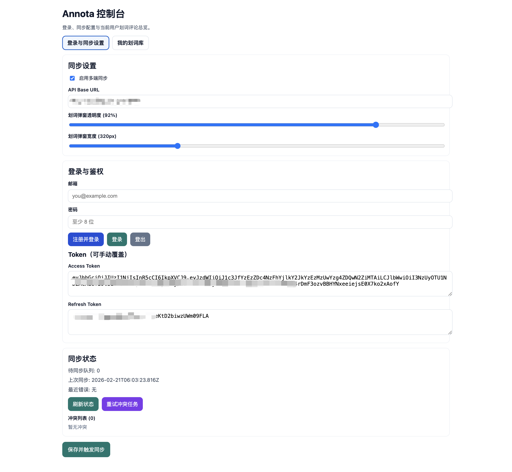
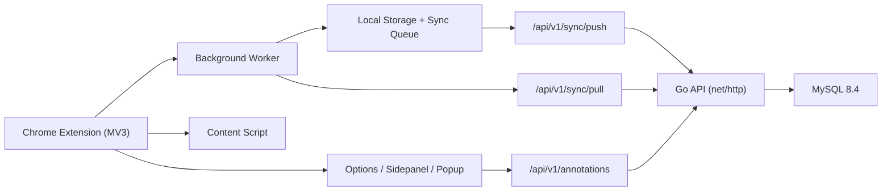

# Annota MVP

[](https://github.com/rayo1uo/annota/stargazers)
[](https://github.com/rayo1uo/annota/network/members)
[](https://github.com/rayo1uo/annota/issues)

English | [中文](./README.zh.md)

An open-source Chrome highlight/comment extension (Manifest V3) with a Go backend and MySQL storage.

Built for people who want:
- fast text highlighting while reading web pages
- comments attached to highlights
- cross-device convergence with conflict handling
- self-hosted deployment in Docker

Repository: [github.com/rayo1uo/annota](https://github.com/rayo1uo/annota)  
Go module: `github.com/rayo1uo/annota/server`

## Why Annota

- Practical MVP: login, sync, conflict retry, and privacy deletion are already connected end-to-end.
- Friendly UX: side panel browsing, locate-to-source, edit comment/color, keyword search, pagination.
- Engineering-oriented: clean backend boundaries (`handler/service/repository`) and migration-based MySQL schema.
- Easy to self-host: one `docker-compose.yml` runs API + MySQL.

If this project helps you, please give it a star. It helps a lot.

## Feature Snapshot

- Multi-color highlight for selected text on web pages
- Add/edit comments for highlights
- Click highlight to reopen the editor dialog
- Side Panel: list highlights on current page and jump back to source
- Library view: URL grouping + keyword search + pagination
- Auth flow: register, login, refresh token, logout
- Sync pipeline: local queue + `/sync/push` + `/sync/pull`
- Conflict tracking and retry
- Privacy endpoint to delete current user data

## Screenshots

<p align="center">
  <a href="./docs/screenshots/annota-sidepanel.png">
    
  </a>
  <a href="./docs/screenshots/annota-editor-dialog.png">
    
  </a>
</p>
<p align="center">
  <sub><b>Side Panel</b> · Current page highlights and quick actions</sub> &nbsp;&nbsp;&nbsp;
  <sub><b>Editor Dialog</b> · Multi-color highlight + comments</sub>
</p>

<p align="center">
  <a href="./docs/screenshots/annota-library.png">
    
  </a>
  <a href="./docs/screenshots/annota-sync-settings.png">
    
  </a>
</p>
<p align="center">
  <sub><b>Library</b> · URL grouping, search, pagination</sub> &nbsp;&nbsp;&nbsp;
  <sub><b>Sync Settings</b> · Auth and cross-device sync controls</sub>
</p>

## Architecture (Simplified)



## Tech Stack

- Extension: TypeScript + React + Vite + CRXJS (Manifest V3)
- Backend: Go (`net/http`)
- Storage: MySQL 8.4 (with in-memory fallback)
- Deployment: Docker Compose

## Quick Start (Docker, Recommended)

### 1) Prerequisites

- Docker + Docker Compose
- Node.js 18+ (for building extension)

### 2) Start MySQL + API

```bash
cp .env.docker.example .env
make docker-up
make docker-logs
```

Default ports:
- API: `http://127.0.0.1:8080`
- MySQL: `127.0.0.1:3306`

### 3) Build and Load Extension

```bash
make extension-install
make extension-build
```

Then open `chrome://extensions`:
1. Enable Developer mode
2. Click "Load unpacked"
3. Select `extension/dist`

### 4) Configure Backend URL

Set API Base URL in extension Options page, for example:

`http://127.0.0.1:8080`

Also ensure backend `ALLOWED_ORIGINS` includes:

`chrome-extension://<your-extension-id>`

## Local Development

### Extension

```bash
make extension-install
cd extension && npm run build
```

### Backend

```bash
cp server/.env.example server/.env
make server-migrate
make server-run
```

Useful checks:

```bash
make server-test
make release-check
```

## Core APIs

- `GET /api/v1/health`
- `POST /api/v1/auth/register`
- `POST /api/v1/auth/login`
- `POST /api/v1/auth/refresh`
- `POST /api/v1/auth/logout`
- `GET /api/v1/annotations` (optional `url`, Bearer required)
- `POST /api/v1/annotations` (Bearer required)
- `PATCH /api/v1/annotations/{id}` (Bearer required)
- `DELETE /api/v1/annotations/{id}?url=...` (Bearer required)
- `POST /api/v1/sync/push` (Bearer required)
- `GET /api/v1/sync/pull?cursor=0&limit=50` (Bearer required)
- `DELETE /api/v1/me/data` (Bearer required)

Backend details: `server/README.md`

## Project Structure

```text
.
├── extension/              # Chrome extension codebase
│   ├── src/background      # sync/storage/message handling
│   ├── src/content         # highlight rendering and interaction
│   ├── src/sidepanel       # side panel UI
│   ├── src/options         # options page
│   └── src/popup           # popup page
├── server/                 # Go API service
│   ├── cmd/api             # API entrypoint
│   ├── cmd/migrate         # migration entrypoint
│   ├── internal/http       # router and handlers
│   ├── internal/storage    # memory/mysql repositories
│   └── migrations          # SQL migrations
├── docs/                   # design/deployment/regression docs
├── docker-compose.yml
└── Makefile
```

## Roadmap

- [x] Multi-color highlight + comments
- [x] Manual sync + cross-device merge
- [x] Search in current page + library
- [x] URL and annotation pagination in library
- [ ] Better anchor robustness for dynamic websites
- [ ] Import/export backups
- [ ] One-click cloud deployment template

## Troubleshooting

- `go mod download` timeout:
  tune `GOPROXY` / `GOSUMDB` in Docker build args.
- CORS blocked from extension:
  ensure `ALLOWED_ORIGINS` contains real `chrome-extension://<id>`.
- No highlights after login:
  verify API Base URL, then run sync and refresh page.

## Contributing

Issues and PRs are welcome.

If you want to contribute, start from:
- `docs/chrome-annotation-mvp-technical-plan.md`
- `docs/chrome-annotation-t20-manual-regression-checklist.md`

## Docs

- Deployment: `docs/chrome-annotation-aliyun-ecs-docker-deploy.md`
- Technical plan: `docs/chrome-annotation-mvp-technical-plan.md`
- Regression results: `docs/chrome-annotation-t20-manual-regression-results.md`

---

If you find Annota useful, a star on [GitHub](https://github.com/rayo1uo/annota) is the best support.
