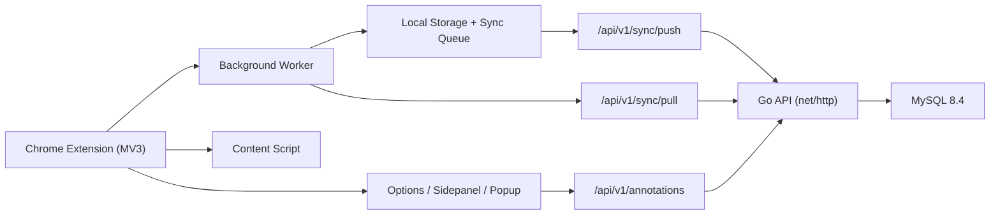

# Annota MVP

[](https://github.com/rayo1uo/annota/stargazers)
[](https://github.com/rayo1uo/annota/network/members)
[](https://github.com/rayo1uo/annota/issues)

[English](./README.md) | 中文

一个开源的 Chrome 划词高亮/评论插件（Manifest V3），配套 Go 后端与 MySQL 存储。

适合你如果你想要：
- 在网页阅读时快速高亮重点
- 给高亮片段附加评论
- 在多设备之间同步并处理冲突
- 以 Docker 方式自建和部署

仓库地址：[github.com/rayo1uo/annota](https://github.com/rayo1uo/annota)  
Go 模块：`github.com/rayo1uo/annota/server`

## 为什么是 Annota

- 实用 MVP：登录、同步、冲突重试、隐私删除都已端到端打通。
- 体验友好：侧边栏浏览、定位原文、编辑评论/颜色、关键词搜索、分页。
- 工程可维护：后端分层清晰（`handler/service/repository`），MySQL 迁移可追踪。
- 易于自托管：一个 `docker-compose.yml` 启动 API + MySQL。

如果这个项目对你有帮助，欢迎点一个 Star。

## 功能速览

- 多颜色网页文本高亮
- 高亮评论的新增/编辑
- 点击高亮可复用弹窗继续编辑
- Side Panel：查看当前页面高亮并跳转定位
- 划词库：按网址分组 + 关键词搜索 + 分页
- 鉴权流程：注册、登录、刷新 Token、登出
- 同步链路：本地队列 + `/sync/push` + `/sync/pull`
- 冲突记录与重试
- 隐私接口：删除当前用户数据

## 截图展示

<p align="center">
  <a href="./docs/screenshots/annota-sidepanel.png">
    
  </a>
  <a href="./docs/screenshots/annota-editor-dialog.png">
    
  </a>
</p>
<p align="center">
  <sub><b>侧边栏</b> · 当前页面高亮与快捷操作</sub> &nbsp;&nbsp;&nbsp;
  <sub><b>编辑弹窗</b> · 多色高亮与评论编辑</sub>
</p>

<p align="center">
  <a href="./docs/screenshots/annota-library.png">
    
  </a>
  <a href="./docs/screenshots/annota-sync-settings.png">
    
  </a>
</p>
<p align="center">
  <sub><b>划词库</b> · 网址分组、搜索、分页</sub> &nbsp;&nbsp;&nbsp;
  <sub><b>同步设置</b> · 鉴权与多端同步开关</sub>
</p>

## 架构图（简化）



## 技术栈

- 扩展端：TypeScript + React + Vite + CRXJS（Manifest V3）
- 后端：Go（`net/http`）
- 存储：MySQL 8.4（支持内存存储回退）
- 部署：Docker Compose

## 快速开始（推荐 Docker）

### 1) 环境准备

- Docker + Docker Compose
- Node.js 18+（用于构建扩展）

### 2) 启动 MySQL + API

```bash
cp .env.docker.example .env
make docker-up
make docker-logs
```

默认端口：
- API: `http://127.0.0.1:8080`
- MySQL: `127.0.0.1:3306`

### 3) 构建并加载扩展

```bash
make extension-install
make extension-build
```

然后打开 `chrome://extensions`：
1. 开启开发者模式
2. 点击“加载已解压的扩展程序”
3. 选择 `extension/dist`

### 4) 配置后端地址

在扩展 Options 页面填写 API Base URL，例如：

`http://127.0.0.1:8080`

并确保后端 `ALLOWED_ORIGINS` 包含：

`chrome-extension://<你的扩展ID>`

## 本地开发

### 扩展

```bash
make extension-install
cd extension && npm run build
```

### 后端

```bash
cp server/.env.example server/.env
make server-migrate
make server-run
```

常用检查：

```bash
make server-test
make release-check
```

## 核心 API

- `GET /api/v1/health`
- `POST /api/v1/auth/register`
- `POST /api/v1/auth/login`
- `POST /api/v1/auth/refresh`
- `POST /api/v1/auth/logout`
- `GET /api/v1/annotations`（`url` 可选，Bearer 必需）
- `POST /api/v1/annotations`（Bearer 必需）
- `PATCH /api/v1/annotations/{id}`（Bearer 必需）
- `DELETE /api/v1/annotations/{id}?url=...`（Bearer 必需）
- `POST /api/v1/sync/push`（Bearer 必需）
- `GET /api/v1/sync/pull?cursor=0&limit=50`（Bearer 必需）
- `DELETE /api/v1/me/data`（Bearer 必需）

后端详情见：`server/README.md`

## 项目结构

```text
.
├── extension/              # Chrome 扩展代码
│   ├── src/background      # 同步、存储、消息分发
│   ├── src/content         # 页面高亮渲染与交互
│   ├── src/sidepanel       # 侧边栏 UI
│   ├── src/options         # 配置页
│   └── src/popup           # 弹窗页
├── server/                 # Go API 服务
│   ├── cmd/api             # API 入口
│   ├── cmd/migrate         # 迁移入口
│   ├── internal/http       # 路由与 handler
│   ├── internal/storage    # memory/mysql 仓储实现
│   └── migrations          # SQL 迁移
├── docs/                   # 设计、部署、回归文档
├── docker-compose.yml
└── Makefile
```

## Roadmap

- [x] 多色高亮 + 评论
- [x] 手动同步 + 多端合并
- [x] 当前页与划词库关键词搜索
- [x] 划词库网址与高亮分页
- [ ] 动态网页锚点鲁棒性增强
- [ ] 划词数据导入/导出
- [ ] 一键云部署模板

## 常见问题

- `go mod download` 超时：
  可在 Docker 构建参数中调整 `GOPROXY` / `GOSUMDB`。
- 扩展请求被 CORS 拒绝：
  检查 `ALLOWED_ORIGINS` 是否包含真实 `chrome-extension://<id>`。
- 登录后无高亮：
  先确认 API Base URL，再执行同步并刷新页面。

## 贡献

欢迎提 Issue 和 PR。

建议先阅读：
- `docs/chrome-annotation-mvp-technical-plan.md`
- `docs/chrome-annotation-t20-manual-regression-checklist.md`

## 文档

- 部署文档：`docs/chrome-annotation-aliyun-ecs-docker-deploy.md`
- 技术方案：`docs/chrome-annotation-mvp-technical-plan.md`
- 回归结果：`docs/chrome-annotation-t20-manual-regression-results.md`

---

如果你觉得 Annota 有帮助，欢迎在 [GitHub](https://github.com/rayo1uo/annota) 点个 Star。
